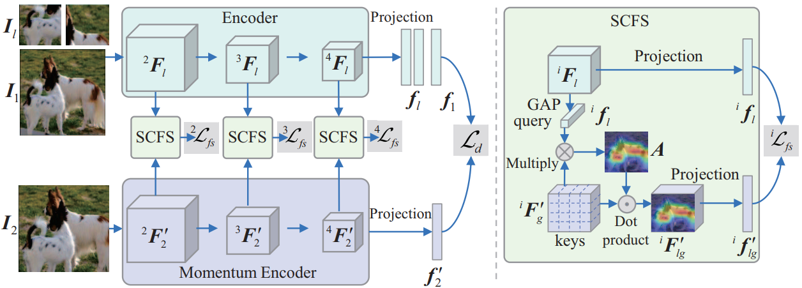

# Semantics-Consistent Feature Search for Self-Supervised Visual Representation Learning
Official Implementation of our paper "**Semantics-Consistent Feature Search for Self-Supervised Visual Representation Learning, ICCV2023.**". 

by Kaiyou Song, Shan Zhang, Zihao An, Zimeng Luo, Tong Wang, and Jin Xie.

**[[arXiv]](https://arxiv.org/abs/2212.06486)**  **[[Paper]](https://openaccess.thecvf.com/content/ICCV2023/papers/Song_Semantics-Consistent_Feature_Search_for_Self-Supervised_Visual_Representation_Learning_ICCV_2023_paper.pdf)**

## Method
 


## Results
| Method | Model    | Batch Size | PT Epochs | k-NN  | Linear Probing   |
|--------|----------|-----------|-----------|-------------|-------------|
| DINO   | ResNet50 |    256    |   200     | 64.0        | 73.0        |
| SCFS   | ResNet50 |    256    |   200     | 65.5 (+1.5) | 73.9 (+0.9) |
| DINO   | ResNet50 |    4080   |   800     | 67.5        | 75.3        |
| SCFS   | ResNet50 |    1024   |   800     | 68.5 (+1.0) | 75.7 (+0.4) |

## Usage

### ImageNet Pre-training

This implementation  supports **DistributedDataParallel** training; single-gpu or DataParallel training is not supported.

To do pre-training of a ResNet50-ViT-S model pairs on ImageNet in an 8-gpu machine, run:

```
python3 main_scfs.py \
--arch resnet50 \
--optimizer sgd --lr 0.1 --min_lr 0.0048 \
--weight_decay 1e-4 --weight_decay_end 1e-4 \
--warmup_teacher_temp 0.04 --teacher_temp 0.07 --warmup_teacher_temp_epochs 50 \
--global_crops_scale 0.25 1 --local_crops_scale 0.05 0.25 \
--dist_url 'tcp://localhost:10009' --multiprocessing_distributed --world_size 1 --rank 0 \
--batch_size_per_gpu 32 \
--use_fp16 True \
--epoch 200 \
--data_path /path to imagenet/ \
--output_dir output/ \
```

### ImageNet Linear Classification

With a pre-trained model, to train a supervised linear classifier on frozen features/weights in an 8-gpu machine, run:

```
python3 -m torch.distributed.launch --nproc_per_node=8 eval_linear.py \
--arch resnet50 \
--lr 0.01 \
--batch_size_per_gpu 256 \
--num_workers 10 \
--pretrained_weights /path to pretrained checkpoints/xxx.pth \
--checkpoint_key teacher \
--data_path /path to imagenet/ \
--output_dir output/ \
--method scfs
```

### Evaluation: k-NN classification on ImageNet
To evaluate a k-NN classifier with a single GPU on a pre-trained model, run:

```
python3 -m torch.distributed.launch --nproc_per_node=8 eval_knn.py \
--arch resnet18 \
--batch_size_per_gpu 512 \
--pretrained_weights /path to pretrained checkpoints/xxx.pth \
--checkpoint_key teacher \
--num_workers 20 \
--data_path /path to imagenet/ \
--use_cuda True \
--method scfs
```

## Acknowledgement
This project is based on [DINO](https://github.com/facebookresearch/dino).
Thanks for the wonderful work.

## License
This project is under the Apache License 2.0 license. See [LICENSE](LICENSE) for details.

## Citation
```bibtex
@InProceedings{Song_2023_ICCV,
    author    = {Song, Kaiyou and Zhang, Shan and Luo, Zimeng and Wang, Tong and Xie, Jin},
    title     = {Semantics-Consistent Feature Search for Self-Supervised Visual Representation Learning},
    booktitle = {Proceedings of the IEEE/CVF International Conference on Computer Vision (ICCV)},
    month     = {October},
    year      = {2023},
    pages     = {16099-16108}
}
```
